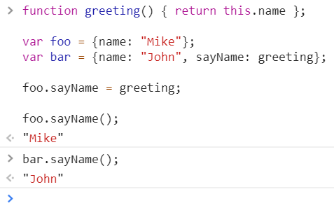

<a href="04.md">next</a>

<h1>This</h1>

В ES ключевое слово <code>this</code> является ссылкой на объект исполнения.

В глобальном контексте <code>this</code> ссылается на глобальный объект.
Все переменные и функции, объявленные в глобальном контексте, являются его свойствами и методами.

Ссылка <code>this</code> внутри функции, может меняться в зависимости от
объекта, в контексте которого вызывается. Контекст определяется в момент вызова.

Пример, объявим функцию с ключевым словом this,
а затем вызовем ее в контексте разных объектов.

<a href="02.md">prev</a>
