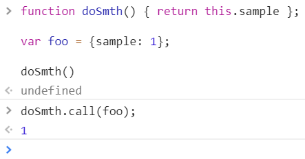

<a href="05.md">next</a>

<h1>This</h1>

Конструктор.
 

Если объект создается при помощи конструктора,
<code>this</code>(конструктора) указывает на вновь созданный объект.

 

<h2>Call / Apply</h2>

Контекст исполнения (объект на который будет ссылаться функция и на который будет указывать ключевое слово this)
можно задавать напрямую, используя специальные методы call и/или apply.
Различие между методами call и apply в передаче аргументов, для apply это массив, а для call список.
<code> func.call(context, arg1, arg2); func.apply(context, [arg1, arg2]) </code>

 

<h2>Bind</h2>

Появился только в ES5, поддержка IE 11+. Синтаксически напоминает call/apply.
<code> func.bind(context, [arg1, arg2]); </code>. Отличие в том, что call/apply сразу вызывают функцию,
передавая ей контекст, а bind не вызывает функцию сразу,
а только привязывает заданный контекст к функции, вызвана же она может быть далее по коду.

 

 

Очень популярным вопросом на собеседовании является реализация функции bind самостоятельно.

<a href="03.md">prev</a>
