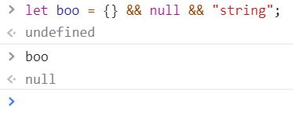
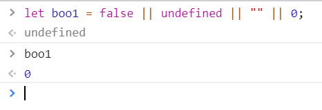

<a href="06.md">next</a>

<h2>Operators</h2>

Оператор - наименьшая автономная часть языка программирования; команда или набор команд.
 
Операнд - элемент данных, над которым выполняется операция.
В зависимости от числа операндов, оператор может быть: унарным, бинарным, тернарным и т.д.

<ul>
<li>
Логические операторы: ! && || !!
</li>
<li>
Операторы сравнения: == === >= <= != !== > < ++ -- ** (инкремент, декремент, степень)
</li>
<li>
Арифметические операторы: + - / * %
</li>
<li>
Операторы присваивания: = += -= *=
</li>
<li>
Языковые операторы: if, switch, else, continue, break, while, do, for, for...in
</li>
<li>
Синтаксис тернарного оператора: condition ? val1 : val2
</li>
<li>
Унарные операторы: delete (объекта, свойства объекта, массива, переменные с var удалить не может, в отличие от тех что объявлены без конструкции var),
typeof, void, in, instanceof
</li>
</ul>

Оператор <code>&&</code> возвращает <strong>последний</strong> операнд, если все операнды истинны,
либо <strong>первый</strong> "ложный" если хоть один операнд ложный.
 

 

 

Аналогия - споткнуться на первой лжи.

Оператор <code>||</code> возвращает <strong>первое</strong> истинное значение,
либо <strong>последнее</strong> ложное, если истинных нет вообще.
Вычисление происходит слева направо
 

 

Аналогия - споткнуться на первой истине.

"Ложью" js считает:

<ul>
<li>
0
</li>
<li>
""
</li>
<li>
false
</li>
<li>
null
</li>
<li>
undefined
</li>
<li>
NaN
</li>
</ul>

На понимание

<code>!(1-1)</code>, <code>!!(2-1)</code>,
<code>"Black" && "White"</code>,
<code>"Black" || "White"</code>,
<code>2 == "2"</code>,
<code>2 === "2"</code>,
<code>2**4</code>,
<code>5 % 2</code>

<a href="04.md">prev</a>
 
<a href="00.md">plan</a>
