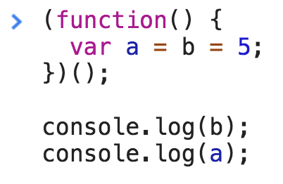

<a href="02.md">next</a>

<h2>interview tasks</h2>

<h3>task 1</h3>

Create code for next conditions

<code>calculate('+')(1)(2); // 3</code>
 
<code>calculate('*')(2)(3); // 6</code>

<a href="https://codepen.io/paawel/pen/Qogrqa?editors=0012">Вариант решения</a>

 

<h3>task 2</h3>

What is the output?

 

<h3>async / defer</h3>

Когда браузер встречает тег script он сначала <strong>скачивает</strong> скрипт, а затем его исполняет,
блокируя отрисовку DOM

 

Атрибуты <code>async</code> и <code>defer</code> оба скачивают скрипт асинхронно(не блокируя отрисовку DOM)

 

НО

 

<code>async</code> начинает выполнять скрипт сразу же как скачал(в этот момент DOM может быть не отрисован)
 
<code>defer</code> даже после того как скачал, ждет пока отрисуется весь DOM и только потом начинает исполнять скрипт

<code>defer</code> - появился позже и по факту более продвинутый <code>async</code>

<a href="00.md">plan</a>
