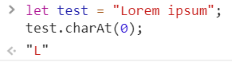
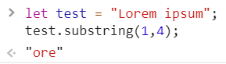
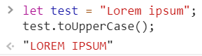
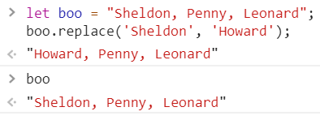

<a href="05.md">next</a>

<h2>String</h2>

Тип данных представляющий из себя упорядоченную последовательность символов Юникода.
У строки есть длина представляющая собой количество значений в ней содержащихся (<code>length</code>).
Нумерация символов строки начинается с нуля.

<ul>
<li>

<code>charAt</code>

</li>
<li>

<code>slice</code>,
<code>substring</code>,
<code>substr</code>(deprecated, https://developer.mozilla.org/en-US/docs/Web/JavaScript/Reference/Global_Objects/String/substr)

</li>
<li>

<code>toUpperCase, toLowerCase</code>

</li>
<li>

<code>split</code> массив из строки

</li>
<li>

<code>replace</code> возвращает строку из символов по заданному шаблону,
шаблон может быть строкой либо RegExp-ом. На примере обратите внимание, что сама строка не меняется.

</li>
<li>

<code>includes</code>

</li>

</ul>

<h3>RegExp</h3>

Регулярные выражения не являются особенностью js или его уникальной конструкцией,
в js есть специальный объект RegExp который предоставляет API для работы с ними.
Одной из традиционно популярных задач,
для решения которых во фронт-енде используются регулярные выражения, это валидация полей формы.

(вик) - формальный язык поиска и манипуляций с подстроками в тексте,
основанный на использовании метасимволов.
Для поиска используется строка-образец (шаблон) состоящий из символов и метасимволов, задающая правило поиска.

Где мы уже сталкивались с регулярными выражениями в CSS ?

<h3>Шаблонный литерал(строка)</h3>

Заключены в обратные кавычки <code>` `</code>.
Может принять любое js выражение(переменную, функцию и тд.), обозначаемое знаком доллара и фигурными скобками <code>${ condition }</code>.
Символ обратной кавычки в шаблонной строке экранируется обратным слэшем <code>`\``</code>.
 
В отличие от обычных строк, в шаблонных строках можно использовать символы переноса строк, а также теги.

<a href="03.md">prev</a>
 
<a href="00.md">plan</a>
