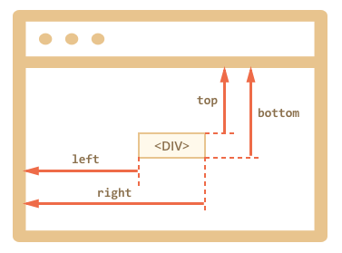

<a href="07.md">next</a>

<h2>Coordinates on the page</h2>

Координаты страницы отсчитываются от верхнего левого угла.
Для получения существует метод <code>getBoundingClientRect</code>.
<a href="https://codepen.io/paawel/pen/YjjMBK?editors=1111">Example</a>.
Кроме высоты и ширины самого элемента метод возвращает координаты относительно
видимой области в пикселях.

 

<h3>Scroll, lazy loading</h3>

Существуют сценарии завязанные на скролл страницы, в частности по скроллу может происходить lazy loading.
Соответствующее событие существует в браузере а количество проскроленного по осям можно <a href="https://codepen.io/paawel/pen/OjzBQP?editors=1011">получить</a>
через свойство window scrollY или scrollX.

<h3>Element From Point</h3>

При помощи метода <code>elementFromPoint</code> можно <a href="https://codepen.io/paawel/pen/EvoOaO?editors=1011">получить</a>
элемент на странице относительно заданных координат.

<a href="05.md">prev</a>
 
<a href="00.md">plan</a>
