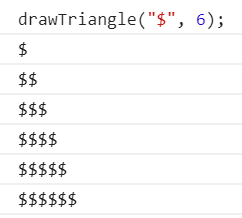
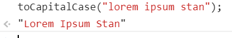

<h1>
    Homework 3
</h1>

<ol>
<li>
Реализовать счетчик на js.
Каждый вызов функции возвращает велечину на 1 больше.

myCounter() => 1;
myCounter() => 2;
myCounter() => 3;
</li>
<li>
Реализовать метод <code>bind</code>
</li>
<li>
Напишите функцию, которая рисует треугольник
Функция принимает 2 аргумента.
Первый аргумент это произвольный символ из которого будет состоять треугольник,
второй аргумент - высота треугольника.
Высота треугольника не может быть меньше 3 строк (то есть вызов функции со вторым аргументом равным 1-це, всё равно нарисует треугольник высотой 3, любой другой аргумент больше 3-х нарисует треугольник согласно величине аргумента).

</li>
<li>
Напишите функцию, которая принимает строку и возвращает строку с заглавными буквами.

</li>
<li>
Напишите функцию, которая принимает аргумент из объекта и возвращаaет объект меняя местами ключ и значение.

</li>
</ol>
