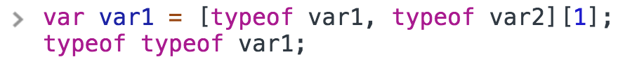

<a href="02.md">next</a>

<h2>interview tasks</h2>

<h3>task 1</h3>

Once again

<code>typeof null</code> ?

<h3>task 2</h3>

Result?

 

<strong>***</strong>

<h3>task 3</h3>

Result?

 

<h3>Strict mode</h3>

<code>'use strict'</code> директива появилась в ES-5 с целью решить проблему совместимости старого и нового стандартов.
Директиву можно указать как глобально, так и локально(внутри функции, тогда эффект только в функции). Директива меняет привычное поведение языка, исправляя ряд ошибок.

 
Например в строгом режиме нельзя создавать переменные без ключевого слова var.

 

 
А также переопределять значения псевдо-массива <code>arguments</code>
(Почему псевдо? Методы массива к нему применить нельзя, хотя у него и есть свойство <code>length</code>).

 

<strong>***</strong> добавить 'use strict'.

<a href="00.md">plan</a>
