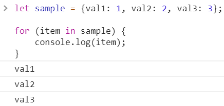
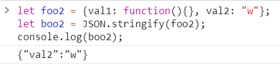

<a href="03.md">next</a>

<h2>Object</h2>

Хранилище вида ключ-значение.
Доступ к свойствам объекта осуществляется при помощи оператора <code>.</code>,
подобным же образом происходит присвоение значения свойству.
Существует и альтернативный способ обращения к свойству через <code>[]</code>,
полезен при обращении к свойствам имена которых состоят из более одного слова (либо когда в качестве ключа выступает переменная).

 

 

Удаление свойства объекта - оператор <code>delete</code>.

Частая задача - перебор свойств объекта. Оператор <code>for in</code>.

 

<h3>JSON</h3>

JavaScript Object Notation.
(вик) - текстовый формат обмена данными, основанный на JavaScript(разработан Дугласом Крокфордом).
Формат независим от языка, используется повсеместно в Web разработке.
В JS есть специальный объект для работы с JSON.

 

JSON похож на обычный js объект, но имеет особенности.

<ol>
<li>
Ключ должен быть заключен в двойные кавычки обязательно(НЕ одинарные).
</li>
<li>
Значением ключа не может быть функция или undefined (как в js), а должно быть:
числом, строкой(в двойных, НЕ одинарных кавычках), булевым типом либо null.
</li>
<li>
Не допускаются комментарии
</li>
</ol>

<h4>Методы для работы с JSON</h4>

<code>parse</code>преобразует ИЗ JSON

 

 
<code>stringify</code> преобразует В JSON

 

Часть данных которые не могут быть преобразованы в JSON могут быть проигнорированы при попытке приведения

 

<a href="01.md">prev</a>
 
<a href="00.md">plan</a>
