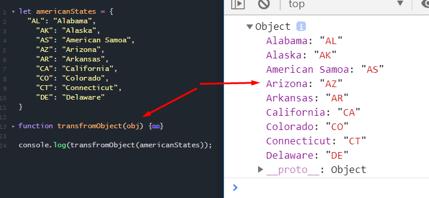

<h1>
    Homework 4
</h1>

<ol>
<li>
<strong>Индивидуально</strong>

 

Напишите функцию, которая принимает аргумент из объекта и возвращаaет объект меняя местами ключ и значение.

 

</li>

<li>
<strong>В командах</strong>
 

Реализуйте следующую логику:
 

На странице разместите 5 блоков и 6-й блок для результата.
Каждый блок(из 5-ти) должен состоять из опросника из 4х радио-баттонов.
А в 6-м блоке кнопка - "увидеть результат".
Блоки необходимо визуально разграничить(css).
 

После нажатия кнопки происоходит сбор данных и вывод результата.

 

Тема опросника произвольная.
 

Логика результата следующая: каждый выбор имеет вес, условных результата должно быть 4-5 вариантов,
каждый из которых показывается в зависимости от суммы баллов вариантов.

</li>

</ol>
