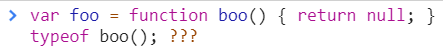
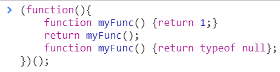
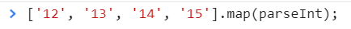

<a href="02.md">next</a>

<h2>Interview tasks</h2>

<strong>Result?</strong>

 

 

<strong>Result?</strong>

 

 

<strong>Result?</strong>

 

 

<strong>***</strong>

<strong>***</strong>
<a href="https://developer.mozilla.org/en-US/docs/Web/JavaScript/Reference/Global_Objects/parseInt">parseInt</a>
<a href="https://developer.mozilla.org/en-US/docs/Web/JavaScript/Reference/Global_Objects/Array/map">map</a>

Map при каждой итерации принимает 2 аргумента(значение текущего элемента и его индекс).
При каждом вызове parseInt в метод попадает 2 аргумента, причем второй parseInt воспринимает как систему исчисления
в котрой необходимо проводить преобразование. Например:

 

Таким образом во второй аргумент parseInt попадает индекс элемента массива.

<a href="00.md">plan</a>
