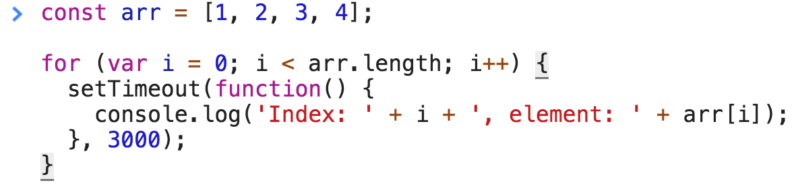

<a href="03.md">next</a>

<h2>Timeout and Interval</h2>

Суть таймера в возможности задерживать исполнение части кода на заданное разработчиком время.
Время задается в миллисекундах (1 секунда = 1000 миллисекунд).

<code>
setTimeout(); clearTimeout();
</code>
 
<code>
setInterval(); clearInterval();
</code>

 

<ul>
<li>
Таймер не часть стандарта ES, он является по сути специальным <strong>методом объекта window</strong>, для работы в среде браузера.
</li>
<li>
Код установленный в таймере может сработать <strong>только тогда, когда остальные операции выполнены и поток исполнения свободен</strong>.
(однопоточность js)
</li>
<li>
Таймеры выстраиваются в очередь (при конфликте их исполнения) и <strong>ни один таймер не может прервать выполнение другого</strong>.
По общему правилу (которое может варьироваться от браузера) очередь организуется по принципу:
"первым пришел - первым обслужен" (FIFO ‘first in - first out’, существует также обратный принцип LIFO - ‘last in - first out’).
</li>
<li>
ВременнОе исполнение таймера не гарантировано в силу однопоточности языка.
Если выполнение таймера блокируется, то выполнение произойдет в тот момент, когда это станет возможным.
</li>
<li>
У таймера существует минимальная задержка, устанавливаемая самим браузером (до 4 мс в зависимости от браузера).
</li>
</ul>

Разберем классическую задачу с собеседования. Что выведет код ниже:

<code>
for(var i = 0; i<5; i++) { setTimeout(function(){ console.log(i) }, 1000) }
</code>

 

Интуитивно ожидается, что код выведет: <code>0 1 2 3 4</code>, с заданным интервалом в одну секунду.
Однако результат оказывается следующим: <code>5 5 5 5 5</code>

 

Причина: В очередь попали 5 таймеров каждый из которых ссылается на переменную i, которая к моменту окончания цикла равна 5-ке.
Добится ожидаемого результата возможно объявив i через let, а не var, let создает изолированную область видимости для блоков
с фигурными скобками.

<h2>clearTimeout</h2>

Метод setTimeout возвращает числовой идентификатор таймера.

 

<code>
var timer = setTimeout(function(){}, 1000); timer -> 1
</code>

 

Удалить таймер можно передав этот самый идентификатор в clearTimeout или clearInterval соответственно.

 

<code>
clearInterval(timer);
</code>

<a href="01.md">prev</a>
 
<a href="00.md">plan</a>
