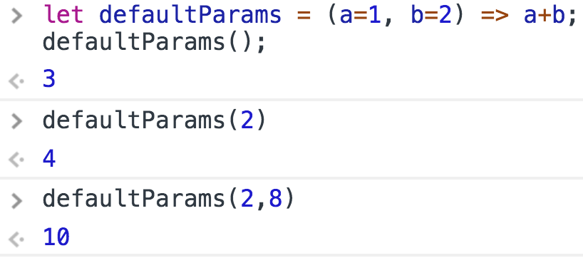
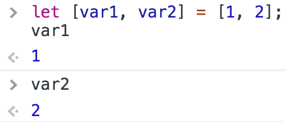
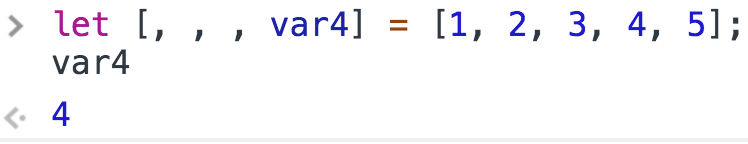
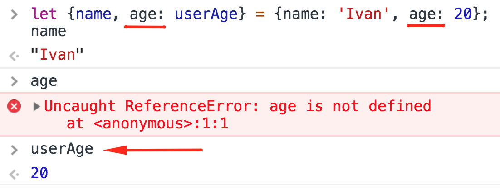
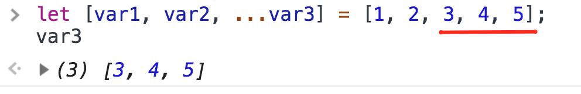

<a href="03.md">next</a>

<h2>ECMAScript 2015(ES6)</h2>

Кроссбраузерность обеспечивают трансляторы кода,
которые переводят конструкции <a href="http://es6-features.org/">ES6</a> в старые версии стандарта.
Самым популярным является <code>Babel</code> (https://babeljs.io/).

<h3>default params</h3>

 

<h3>Destructuring(деструктуризация)</h3>

Синтаксис присвоения значений сразу нескольким переменным.
Каждому последующему элементу массива слева присвоить
каждое последующее значение элемента массива справа.

 

 

Деструктуризация объекта.
По умолчанию имена переменных и ключей объекта должны совпадать,
однако это можно легко переопределить указав через
двоеточие необходимое имя.

 

<h3>Spread operator <code>...</code></h3>

Массив всех последующих элементов независимо от их
количества(слева оператор spread <strong>всегда последний</strong>).

 

 
<a href="01.md">prev</a>
 
<a href="00.md">plan</a>
