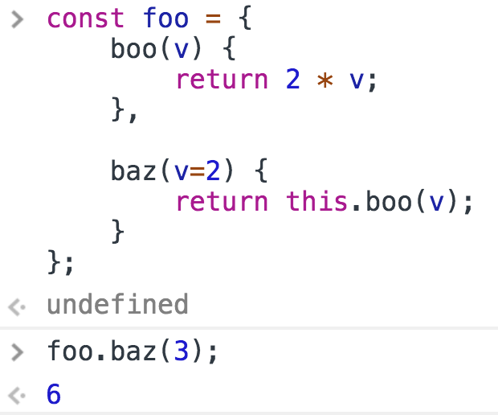
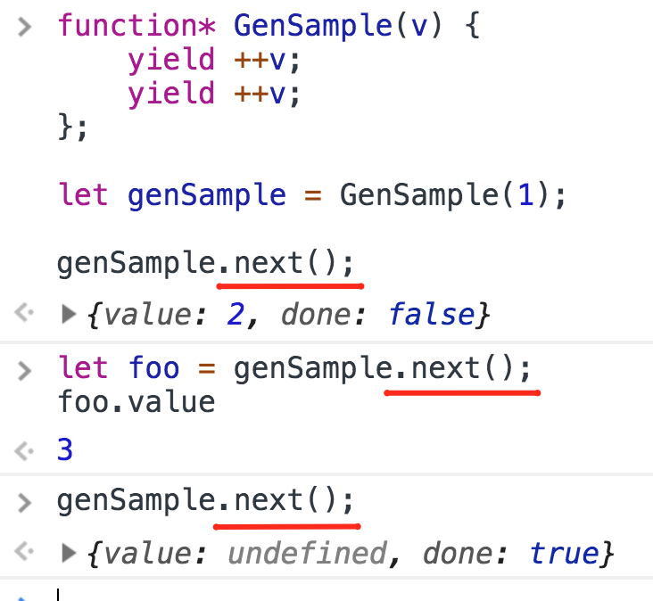

<a href="04.md">next</a>

<h2>ECMAScript 2015(ES6)</h2>

<h3>Методы в объекте</h3>

Методы в объекте объявляються в стиле ООП языков.

 

<h3>Генераторы</h3>

Функция которая может приостанавливать выполнение,
возвращать промежуточный результат, а затем возобновлять работу.

Ключевое слово <code>yeild</code>.
С его помощью указывается значение которое необходимо
вернуть при очередном вызове генератора.
Вызывается очередное значение при помощи метода генератора <code>next()</code>.
Вызов метода <code>next()</code> возвращает объект со значением из yeild(value) и
статусом генератора(done).

Вызывать метод <code>next()</code> генератора можно и после того
как все значения из генератора возвращены, в таком случае
генератор будет возвращать объект с <code>done: true и value: undefined</code>.
Запустить этот же генератор заново нельзя, но можно объявить новый.

 

 
<a href="02.md">prev</a>
 
<a href="00.md">plan</a>
