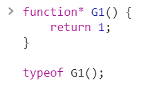
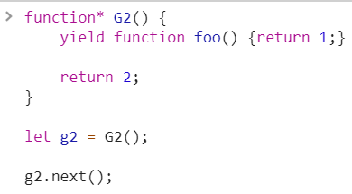
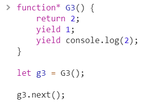
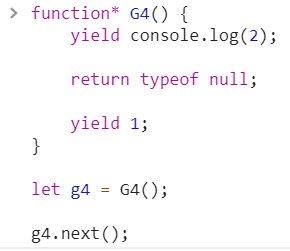
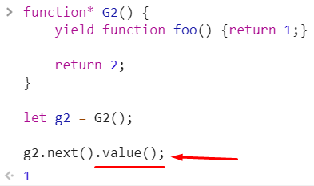

<a href="02.md">next</a>

<h2>Interview tasks</h2>

<strong>Result?</strong>

 

 
 

<strong>Result?</strong>

 

 
 

<strong>Result?</strong>

 

 
 

<strong>Result?</strong>

 

<h3>Generator tasks</h3>

<strong>Result?</strong>

 

 
 

<strong>Result?</strong>

 

 
 

<strong>Result?</strong>

 

 
 

<strong>Result?</strong>

 

 
 

<strong>***</strong>
<ul>
<li>
При вызове функция-генератор возвращает специальный объект, описывающий состояние генератора.
Следовательно <code>typeof</code> вернет <code>"object"</code>.
</li>
<li>
При вызове метода <code>next</code> из генератора возвращается код описанный очередным yield.
Во втором примере вернется сама функция, но вызвана она не будет. Сработает вот так:

 

</li>

<li>
Команда <code>return</code> переведет генератор в состояние <code>{done: true}</code>.
Последующие вызовы будут возвращать один и тот же объект(завершенный).
</li>

<li>
Ответ:
 

</li>
</ul>

<a href="00.md">plan</a>
