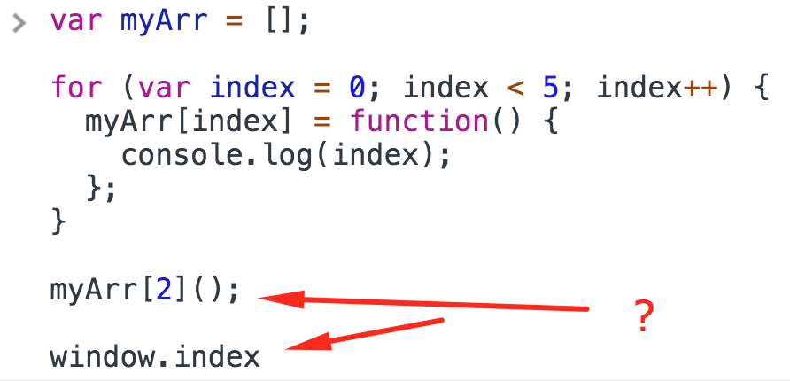
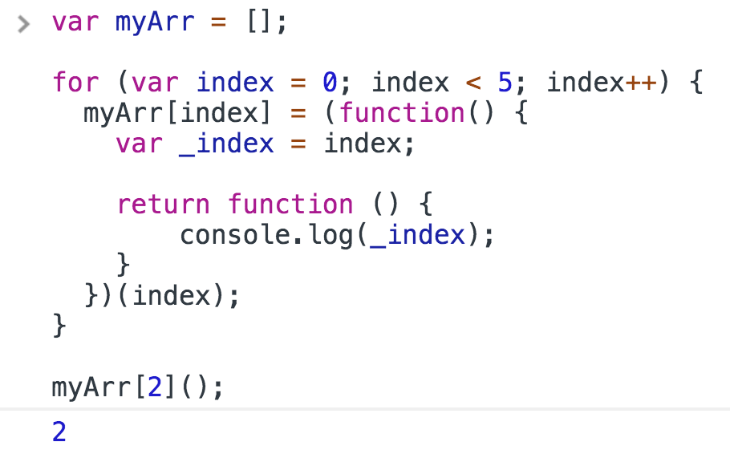

<a href="02.md">next</a>

<h2>Interview tasks</h2>

<strong>Result?</strong>
 
<strong>Как вывести нужный вариант без использования <code>let</code>?</strong>

 

 

 
 

<strong>***</strong>

 
 

<a href="00.md">plan</a>
