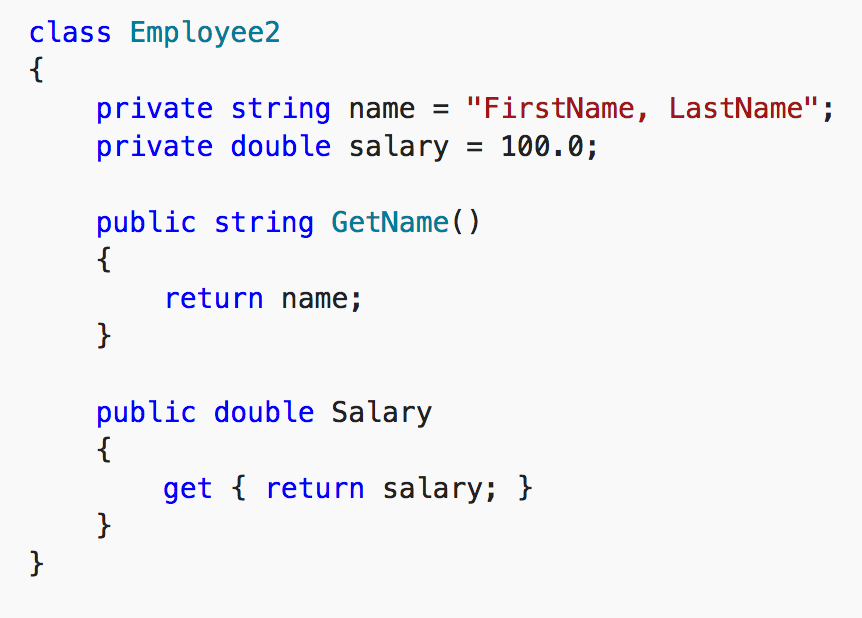
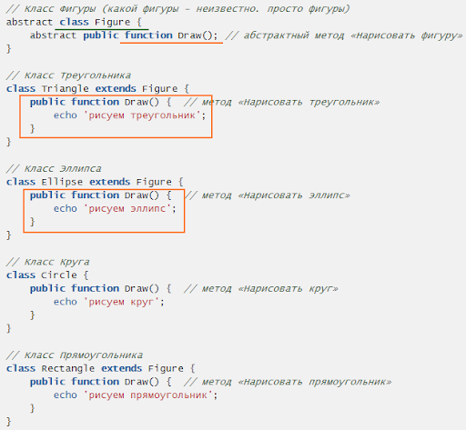

<a href="03.md">next</a>

<h2>Inheritance</h2>

<h3>OOP</h3>

Объектно ориентированное программирование.
(вик) Методология основанная на представлении программы в виде совокупности объектов,
каждый из которых является экземпляром определенного класса. Парадигмы:

 

<ul>
<li>
<code>
Class, Object
</code>
Класс представляет собой абстрактное множество обобщенных характеристик какой то сущности.
Классы могут расширять (extends) другие Классы, добавляя к их характеристикам собственные,
таким образом экземпляры одного Класса могут получать характеристики сразу
целого набора Классов, что позволяет избегать повторения кода.
Свойства и методы классов имеют права доступа. Свойство/метод может быть либо спрятано (приватно),
вследствии чего к нему нет возможности обратиться извне, либо открыто (публично).
Распознать права доступа помогают специальные идентификаторы : private или public.
Существуют и иные модификаторы прав доступа, к примеру protected,
при таком идентификаторе свойство доступно извне только экземплярам Класса.

 

</li>
<li>
<code>
Interface
</code>
(вик)Программная/синтаксическая структура, определяющая отношение между объектами,
которые разделяют определенное поведенческое множество и не связаны никак иначе
При проектировании классов, разработка интерфейса тождественна разработке спецификации
(множества методов, который каждый класс, использующий интерфейс должен реализовывать). (*вик)
Проще говоря интерфейсы описывают "что", созданные на их основе Классы описывают "как".
</li>
<li>
<code>
Inheritance(Наследование)
</code>
Перенимание потомком характеристик родителя.
</li>
<li>
<code>
Encapsulation(Инкапсуляция)
</code>
Упаковка данных и/или функций в единый компонент.
Данные необходимые для реализации какого либо функционала как
бы складируются вместе(абстрактно) и огораживаются оболочкой.
Часть этих данных доступно извне, другая часть сокрыта.
</li>
<li>
<code>
Polymorphism(Полиморфизм)
</code>
Возможность применения одноименных методов с одинаковыми или
различными наборами параметров в одном классе или в группе классов,
связанных отношением наследования.

 

</li>
</ul>

 

JS язык мультипарадигменный, что означает поддержку и функционального и ооп стилей.

 
<a href="01.md">prev</a>
 
<a href="00.md">plan</a>
