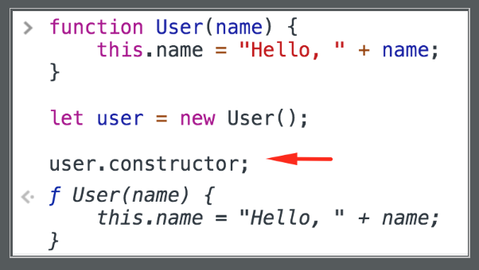

<a href="04.md">next</a>

<h2>Constructor</h2>

Любая функция вызванная при помощи оператора <code>new</code> становится конструктором и возвращает новый объект.

 

Чтобы сориентировать другого разработчика в том, что функция должна применятся в качестве конструктора, такие
функции принято именовать с <strong>заглавной буквы</strong>.
<a href="https://codepen.io/paawel/pen/GLGzQg?editors=1012">Пример</a>.

 

<h3>Constructor and this</h3>

Все поля указанные в функции-конструкторе через <code>this</code> становятся свойствами и методами создаваемых объектов, а само
<code>this</code> ссылается на созданный <a href="https://codepen.io/paawel/pen/KYeJRv?editors=1012">объект</a>.
Таким образом функция-конструктор выступает аналогом "Класса", а создаваемые с ее помощью объекты становяться "Экземплярами".
Иными словами основная задача таких функций - создание(конструирование) новых объектов(экземпляров).

 

<h3>Constructor with return</h3>

Если в конструкторе есть <code>return</code>, то в экземпляр попадет указанный объект без полей <code>this</code>.
<a href="https://codepen.io/paawel/pen/oOyVjg?editors=1012">Пример</a>.
Ньюанс в том, что если возвращаемое значение не является объектом, то конструкция <code>return</code> будет проигнорирована.
<a href="https://codepen.io/paawel/pen/dLKrXY?editors=1012">Пример</a>.
Конструктор может быть вызван и без <code>()</code> если не ждет аргументов.

<h3>Constructor, сокрытие переменных и функций</h3>

Переменные и функции внутри конструктора не доступны в экземплярах(инкапсуляция).
<a href="https://codepen.io/paawel/pen/wZXOdP?editors=1012">Пример</a>. Все свойства и методы которые необходимо сделать доступными
для экземпляров "выносяться" через <code>this</code>, либо напрямую через <code>return</code>.

<h3>Constructor, constructor</h3>

Каждый экземпляр получает свойство <code>constructor</code>, указывающее на функцию-конструктор от которой объект был создан.

 

 
<a href="02.md">prev</a>
 
<a href="00.md">plan</a>
