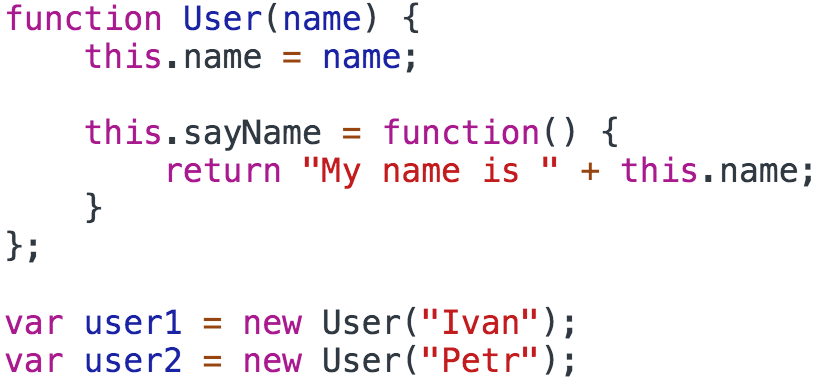
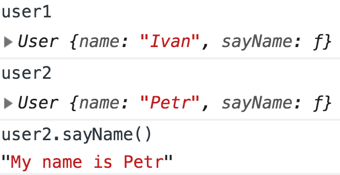

<a href="03.md">next</a>

<h2>Prototype</h2>

Допустим у нас есть Конструктор следующего вида и 2 экземпляра.
В конструкторе есть метод <code>sayName</code>, который мы хотим использовать у каждого
из экземпляров.

 

 

Метод работает, однако обратим внимание, что при создании нового экземпляра создается
и новый метод <code>sayName</code>. Таким образом у нас есть уже 3 метода <code>sayName</code>,
один в конструкторе и 2 в экземплярах и каждый новый экземпляр создаст новый метод <code>sayName</code>.

 

 

Если метод <code>sayName</code> не будет уникальным для экземпляра,
то нам нужен способ избежать не нужного дублирования кода. Для этого в JS существует
механизм <strong>прототипного наследования</strong>, суть которого сводится к тому, что объекты
в js могут наследовать свойства и методы друг друга через цепочку прототипов.
Перепишем код выше и убедимся, что результат остался прежним.

 

 

Обратите внимание, что внутри экземпляров больше нет своего собственного метода <code>sayName</code>, однако он работает.

 

 

 
<a href="01.md">prev</a>
 
<a href="00.md">plan</a>
