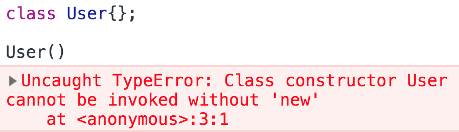

<a href="03.md">next</a>

<h2>ES6 Class</h2>

<h3>Отличия Классов от функций</h3>

В отличие от функции конструктора,<code>class</code> нельзя вызвать как обычную функцию.

 

 
 

Не работает и "поднятие" функции.

 

<h3>Getter/Setter</h3>

Кратко: Геттеры - свойства которые можно только получить, Сеттеры - свойства которые можно только установить.
Используются ключевые слова <code>get</code> и <code>set</code>, которые работают не только в классах, но
и обычных объектах. Посмотрим простой пример. Обратите внимание, что имена методов совпадают.

 

Похожий пример, но уже с классом.

 

 
<a href="01.md">prev</a>
 
<a href="00.md">plan</a>
