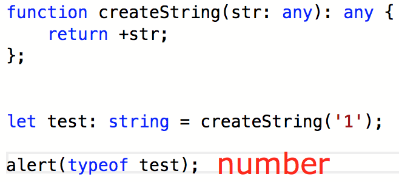
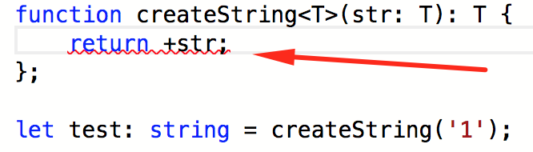

<a href="06.md">next</a>

<h2>Generics</h2>

Откроем файл Generic.ts

 

Пример с <code>any</code> может показаться похожим по функционалу на генерик,
однако <code>any</code> аргумент и <code>any</code> в <code>return</code> это
разные any. Поэтому возможен следующий вариант:

 

 

Генерик связывает входящий аргумент с возвращаемым.

 

 
<a href="04.md">prev</a>
 
<a href="00.md">plan</a>
