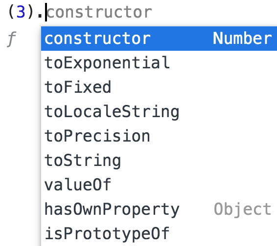

<a href="02.md">next</a>

<h2>Interview tasks</h2>

Как мы знаем строка(как и число) это примитивный тип.
Тем не менее у строки можно вызвать метод(свойство) через точечную нотацию.
Происходит это потомучто в момент вызова JS создает объект-обертку над примитивным типом.
У числа точечная нотация не работает(из за синтаксиса дробных чисел), однако обратится к методам
все таки можно:

 

 

Как реализовать следующий кусок кода?

 

 
 

<strong>***</strong>

 
<h3>Task 1</h3>

<a href="00.md">plan</a>
