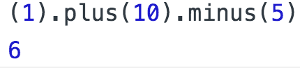
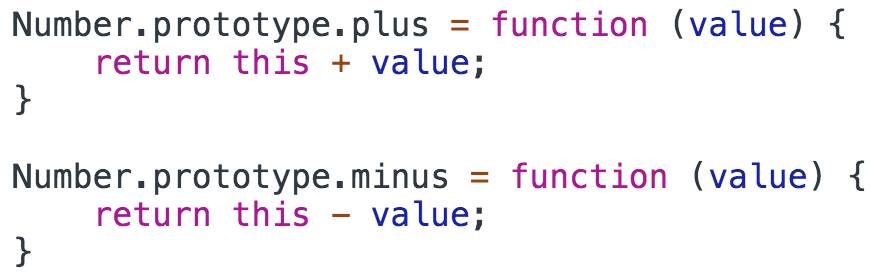

<a href="02.md">next</a>

<h2>Interview tasks</h2>

Как мы знаем строка(как и число) это примитивный тип.
Тем не менее у строки можно вызвать метод(свойство) через точечную нотацию.
Происходит это потомучто в момент вызова JS создает объект-обертку над примитивным типом.
У числа точечная нотация не работает(из за синтаксиса дробных чисел), однако обратится к методам
все таки можно:

 

 
 

Как реализовать следующий кусок кода?

 

<strong>Как проверить что 2 данные строки отличаются только последовательностью символов?</strong>
 
 

<strong>Как определить максимальную длинну последовательностей из подряд идущих единиц в массиве?</strong>
 
 

 
 

<strong>***</strong>

 
<h3>Task 1</h3>

 
<h3>Task 2</h3>

 
<h3>Task 3</h3>

<a href="https://codepen.io/paawel/pen/MdBzwM?editors=0012">Example</a>

<a href="00.md">plan</a>
