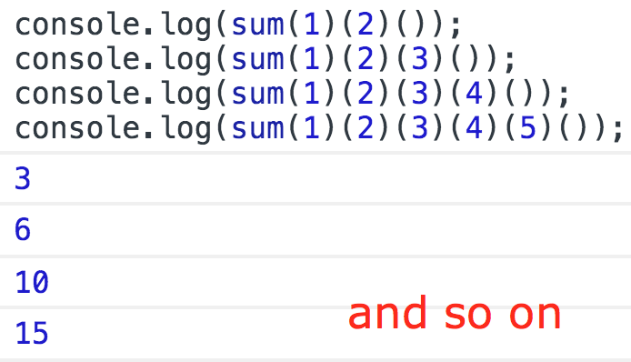

<h1>
    Homework 11
</h1>

<ul>
<li>
Реализовать следующий функционал:

 

</li>
<li>
Функция должны быть написана на Typescript и локально собираться в Javascript
</li>
<li>
Написать тест на проверку работы функции
</li>
<li>
Тест может быть написан на любом фреймворке, запускатся локально.
</li>
</ul>
