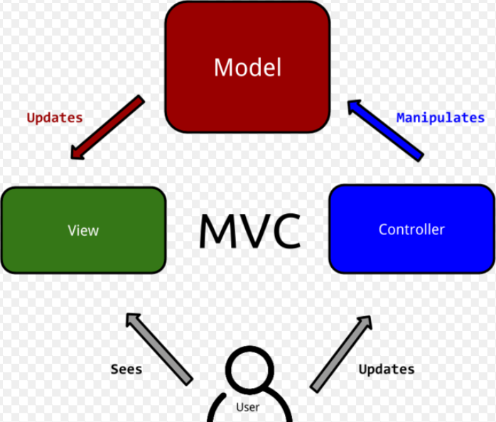

<a href="03.md">next</a>

<h2>Шаблон проектирования</h2>

Одной из ключевых задач при разработке ПО является организация кода таким образом,
чтобы его легко было поддерживать, расширять и вносить правки в случае необходимости.

 

Для чего существуют принципы и шаблоны универсальны для всех языков и платформ, они помогают программистам разговаривать на одном языке.
Мы уже сталкивались с базовыми принципами (DRY, KISS), договоренностями(конструктор с большой буквы, символ нижнего подчеркивания),
методологиями(БЭМ).

 

(вик) Шаблон проектирования(паттерн) - повторяемая архитектурная конструкция,
представляющая собой решение проблемы проектирования в рамках некоторого часто возникающего контекста.

<h3>MVC</h3>

<strong>MVC</strong> сам по себе не является фреймворком или библиотекой, это прежде всего абстракция.
 
Появилась еще в 70-х.
Способ чёткого разделения ответственностей при организации кода приложения.
Шаблон этот очень популярен и используется в таких фреймворках как:
<code>Ruby on Rails</code>, <code>Zend PHP</code>, <code>Asp.net</code> и так далее.

 

(вик)Model-View-Controller - схема разделения данных приложения, пользовательского интерфейса
и управляющей логики на три отдельных компонента: модель, представление и контроллер - таким образом,
что модификация каждого компонента может осуществляться независимо.

 

<ul>
<li>
Модель(Model) предоставляет данные и реагирует на команды контроллера, изменяя своё состояние
</li>
<li>
Представление(View) отвечает за отображение данных модели пользователю, реагируя на изменения модели
</li>
<li>
Контроллер(Controller) интерпретирует действия пользователя, оповещая модель о необходимости изменений
</li>
</ul>

 

Посмотрим пример из <a href="https://www.youtube.com/watch?v=p3CXpKIisPA">урока</a>.

 
<a href="01.md">prev</a>
 
<a href="00.md">plan</a>
