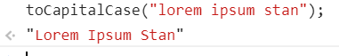

<h1>
    Homework JS 1
</h1>

<ol>
<li>
Напишите функцию, которая рисует треугольник

 

Функция принимает 2 аргумента.

 

Первый аргумент это произвольный символ из которого будет состоять треугольник.

 

второй аргумент - высота треугольника.

 

Высота треугольника не может быть меньше 3 строк(то есть вызов функции со вторым аргументом равным 1-це, всё равно нарисует треугольник высотой 3, любой другой аргумент больше 3-х нарисует треугольник согласно величине аргумента).

 

</li>
<li>
Напишите функцию, которая принимает строку и возвращает строку с заглавными буквами.

 

</ol>
