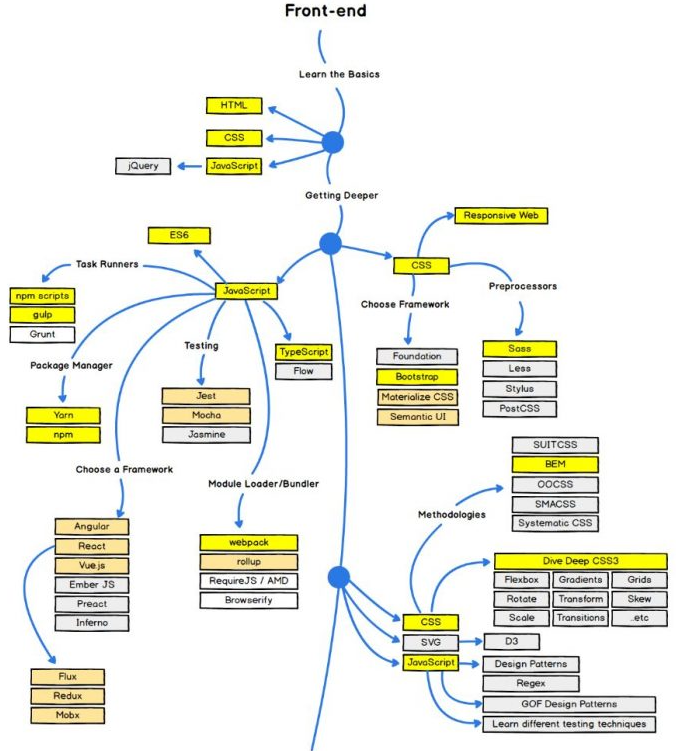

<a href="02.md">next</a>

<ul>
<li>
e-mail: rsk.pawel@gmail.com
</li>
<li>
skype: pawel_rosolko
</li>
<li>
<a href="https://docs.google.com/spreadsheets/d/1YuCiX2R3vXe8GWyLhofwxizIEUJmL5wrX4sB1t3Gba4/edit?usp=sharing">students list</a>
</li>
</ul>

<h2>Work as a front-end developer</h2>
<ul>
<li>
What projects are front-end developers needed on ?
</li>
<li>
Let's see the vacancies
</li>
</ul>

<h2>Course program</h2>

<a href="https://github.com/paawel/training/blob/master/skill_up/MAIN.md">
Course program
</a>

<h2>RoadMap</h2>

What is FrontEnd? Whats the difference between FrontEnd and BackEnd?

<h2>Environment</h2>
<h3>
    Local
</h3>
<ul>
<li>
NotePad / <a href="https://notepad-plus-plus.org/">NotePad++</a>
</li>
<li>
<a href="https://www.sublimetext.com/">Sublime</a>,
<a href="https://code.visualstudio.com/">VS code</a>
</li>
<li>
<a href="https://www.visualstudio.com/">Visual Studio</a>
</li>
<li>
<a href="https://www.jetbrains.com/webstorm/">WebStorm</a>
</li>
</ul>

<h3>Remote</h3>
<ul>
<li>
<a href="http://codepen.io/">CodePen</a> (will be used during the course)
</li>
<li>
<a href="https://jsfiddle.net/">JsFiddle</a>
</li>
<li>
<a href="http://jsbin.com/">JsBin</a>
</li>
</ul>
