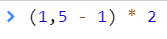

<a href="02.md">next</a>

<h3>
Small task 1
</h3>

<strong>Result?</strong>
 

<h3>
Small task 2
</h3>

<code>
var a;

a !== a; // should be true
</code>

<h3>
Small task 3
</h3>

<code>
var foo = function bar(){ return 12; };

typeof bar();
</code>

<h2>Events</h2>

(*вик) - cообщение которое возникает в различных точках исполняемого кода при выполнении определённых условий.
События предназначены для того, чтобы иметь возможность предусмотреть реакцию программного обеспечения.

В js предусмотрен <a href="https://developer.mozilla.org/ru/docs/Web/Events">ряд</a> различных событий со многими из которых мы уже сталкивались(клик мыши, ввод символа с клавиатуры).
В ответ на любое событие можно вызвать функцию, именуемую <i>callback</i> (колбэк) функцией, то есть “ответом, ответной реакцией”.

<h3>
Добавить обработку события можно:
</h3>

<ul>
<li>
Атрибут в HTML.
Такие атрибуты начинаются на on (onclick, onfocus и пр).
Поддержка такого кода сложная, происходит микс логики и представления, в связи с чем этот способ устаревший.
</li>
<li>
Свойство DOM элемента можно описать и не в разметке, вынеся его в скрипты. <code>element.onclick = function(){}</code>;
Такой способ по сути отличается от первого только местом объявления свойства.
</li>
<li>
<code>addEventListener</code>.
Метод принимает 3 параметра, событие, коллбэк и фазу.
В отличие от <code>onclick</code> можно установить сразу несколько обработчиков на одно событие
</li>
</ul>

 

<code>this</code> внутри обработчика <a href="https://codepen.io/paawel/pen/GewZKo?editors=1011">ссылается</a> на элемент на котором произошло событие.

<h3>addEventListener</h3>

<code>addEventListener</code>(attachEvent аналог для IE до 8 версии).
Метод принимает 3 аргумента: событие, коллбэк функци, фазу.
Отписать элемент от прослушивания события можно при помощи метода <code>removeEventListener</code>.

 

<a href="https://codepen.io/paawel/pen/ZvQaZe?editors=1010">Example</a>

<h3>Объект события</h3>

Содержит информацию о произошедшем событии. В <code>addEventListener (on-event)</code>
объект попадает в коллбек функцию в <a href="https://codepen.io/paawel/pen/OqrQMM">качестве аргумента</a>.
Как видно из примера в объекте довольно много свойств. Рассмотрим популярный сценарий использования
свойства <code>target</code>.

 
<a href="https://codepen.io/paawel/pen/KEbQmX?editors=1010">Example</a>

<a href="00.md">plan</a>
