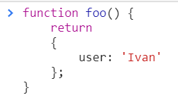
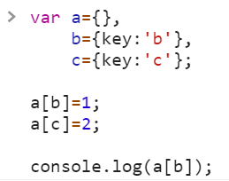
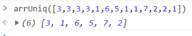

<a href="02.md">next</a>

<h2>Interview tasks</h2>

<h3>task 1</h3>

<h3>task 2</h3>

 

<h3>task 3</h3>

Функция принимает в аргументах массив целых чисел.
Возвращающую массив из уникальных значений первого массива.

 

Например: 

 

<a href="00.md">plan</a>
