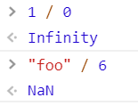
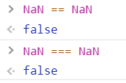
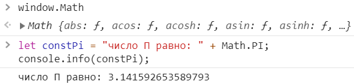
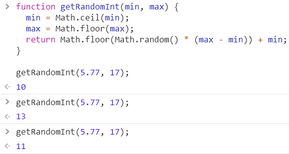
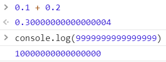

<a href="04.md">next</a>

<h2>Number</h2>

<h3>NaN, Infinity</h3>

Язык поддерживает запись цифр в 16-ти ричной системе(по аналогии с css), однако такой способ встречается редко.
К числовому типу относяться также <code>NaN</code>(Not A Number) и <code>Infinity (-Infinity)</code>.
При том <strong>деление на ноль в js не генерирует ошибки, а возвращает Infinity</strong> (кроме 0 / 0 => NaN).

<code>NaN</code> никогда не равен ничему, в том числе самому себе, для установления <code>NaN</code> - метод <code>isNaN()</code>;

Как уже говорилось - математические операторы приводят свои операнды к числу, если это не "+"(бинарный) который приводит операнд к строке.
Явно привести операнд к числу можно при помощи методов: <code>parseInt()</code> или <code>parseFloat()</code>,
а также <strong>унарным</strong> оператором "+". Оба метода приводят строку к числу пока это возможно, возвращая результат,
кроме случаев когда превести к числу нельзя уже с первого символа.

<h3>Math</h3>

В js представлен специальный объект(встроенный) <code>Math</code>. Содержит в себе ряд методов и констант,
которые могут пригодится в разработке. Например число PI или методы округления и случайного числа.

Функция получения случайного числа в заданных рамках

<h3>Errors</h3>

Существуют математические ошибки в js связанные с особенностью хранения данных например.

Так как случаи это исключительные и редкие, останавливатся на них мы не будем.

<a href="02.md">prev</a>
 
<a href="00.md">plan</a>
