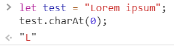
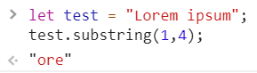
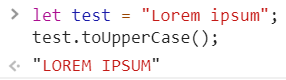
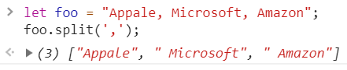
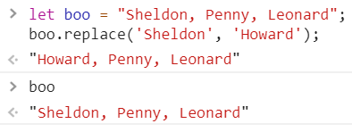
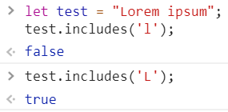
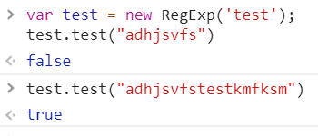

<h2>String</h2>

Тип данных представляющий из себя упорядоченную последовательность символов Юникода.
У строки есть длина представляющая собой количество значений в ней содержащихся (<code>length</code>).
Нумерация символов строки начинается с нуля.

<ul>
<li>

<code>charAt</code>

</li>
<li>

<code>slice</code>,
<code>substring</code>,
<code>substr</code>(deprecated, https://developer.mozilla.org/en-US/docs/Web/JavaScript/Reference/Global_Objects/String/substr)

</li>
<li>

<code>toUpperCase, toLowerCase</code>

</li>
<li>

<code>split</code> массив из строки

</li>
<li>

<code>replace</code> возвращает строку из символов по заданному шаблону,
шаблон может быть строкой либо RegExp-ом. На примере обратите внимание, что сама строка не меняется.

</li>
<li>

<code>includes</code>

</li>

</ul>

<h3>Шаблонный литерал(строка)</h3>

Заключены в обратные кавычки <code>` `</code>.
Может принять любое js выражение(переменную, функцию и тд.), обозначаемое знаком доллара и фигурными скобками <code>${ condition }</code>.
Символ обратной кавычки в шаблонной строке экранируется обратным слэшем <code>`\``</code>.
 
В отличие от обычных строк, в шаблонных строках можно использовать символы переноса строк, а также теги.

<h3>RegExp</h3>

Регулярные выражения не являются особенностью js или его уникальной конструкцией,
в js есть специальный объект <code>RegExp</code> который предоставляет API для работы с ними.
Одной из традиционно популярных задач,
для решения которых во фронт-енде используются регулярные выражения, это валидация полей формы.

(вик) - формальный язык поиска и манипуляций с подстроками в тексте,
основанный на использовании метасимволов.
Для поиска используется строка-образец (шаблон) состоящий из символов и метасимволов, задающая правило поиска.

 

Где мы уже сталкивались с регулярными выражениями в CSS ?

 

Может быть создано при помощи литерала - //, или конструктора RegExp. 
Оператор <strong>typeof возвращает object</strong>.

Простейшим примером РВ может служить проверка совпадения по строке, при такой проверке просто
указывается строка для проверки, например: /test/ или new RegExp(‘test’).
 

 

Однако как правило требуется проверка совпадения не с конкретным символом (или строкой как последовательностью символов),
 а к примеру с любым символом из конечного набора (либо более сложным условием). Делается это при помощи операторов
класса символов, для чего набор сопоставляемых символов заключается в квадратные скобки ( <code>[]</code> ).
 
Например /[abc]/ означает проверку на наличие одного из 3-х символов a, b или с.
Для примера воспользуемся методом строки search, которая принимает регулярное выражение в качестве аргумента и возвращает индекс в строке
<code>"just some string".search(/[abc]/);</code> <code>"just some string".search(/[omg]/);</code>
 
Если же мы хотим указать совпадение со всеми символами КРОМЕ указанных ставится другой специальный символ: ^

 

Еще одной важной возможностью является указание диапазона значений.
К примеру мы хотим установить входит ли буква ‘d’ в диапазон между буквами a и f.
Для этого воспользуемся API объекта RegExp методом test, который вернет нам булев тип.
Затем убедимся, что в заданном диапазоне нету буквы ‘w’.
По мимо test есть метод exec который возвращает первое совпадение, а не булев тип.

<code>/[a-f]/.test('d') -> true; /[a-f]/.test('w') -> false</code>

 

Возвращаясь к шаблону проверки строки, если необходимо проверить наличие совпадения не во всей строке,
а только в ее начале или конце для этого существуют специальные символы: ‘^’ (начало строки, символ такой же как и отрицание в наборе символов, только там он внутри [ ], а тут перед строкой), ‘$’ (конец строки)
/^test/ искать в начале строки, /test$/ искать в конце строки, /^test$/ искать по всей строке.
<code>/^test/.test('foofootest'); -> false; /^test/.test('foofootest'); -> true</code>

 

Строки и диапазоны можно объединять, к примеру проверим что после буквы ‘a’ идет цифра в диапазоне от 3 до 9 (и саму букву а).
 
<code>/a[3-9]/.test('a4foo'); -> true; /a[3-9]/.test('a2foo'); -> false</code>

 

Количество повторений символа можно указать при помощи числа в фигурных скобках, например - {3};
Такое указание именуется квантификатором.
Проверка далее вернет true там, где найдет 3-х значное число.
Для ряда повторяющихся диапазонов существуют специальные классы,
к примеру шаблон поиска цифр [0-9] можно заменить классом “\d” (есть и другие классы, например: \w - латинская буква, цифра или подчеркивание)

<code>/[0-9]{3}/.test('blabla44foofoo555');</code>
 
<code>/\d{5}/.test('foo blabla 33 kabwoo33322'); -> true;  /\d{5}/.test('foo blabla 33 kabwoo3332'); -> false</code>

 

Приведенный материал только небольшая часть возможностей регулярных выражений и носит ознакомительный характер, более подробное изучение выходит за рамки курса.
C большОй долей вероятности не понадобится глубоких знаний в этой теме на начальном этапе изучения js или программирование вообще, огромная часть часто используемых шаблонов регулярных выражений легко найти на просторах интернета, либо как часть популярной библиотеки или фреймворка.
К примеру вот так может выглядеть шаблон валидации e-mail (для поля формы)

<code>/^(([^<>()\[\]\\.,;:\s@"]+(\.[^<>()\[\]\\.,;:\s@"]+)*)|(".+"))@((\[[0-9]{1,3}\.[0-9]{1,3}\.[0-9]{1,3}\.[0-9]{1,3}])|(([a-zA-Z\-0-9]+\.)+[a-zA-Z]{2,}))$/;</code>

<a href="03.md">prev</a>
 
<a href="00.md">plan</a>
