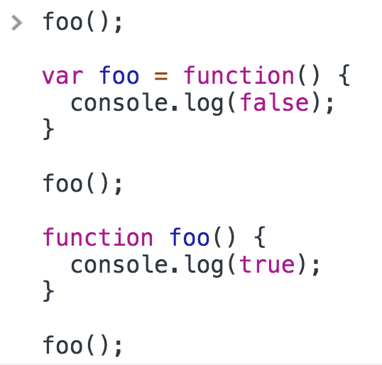

<a href="02.md">next</a>

<h2>Interview tasks</h2>

<h3>task 1</h3>

<code>
sameLetters('qwerty', 'yqwter'); => true

sameLetters('zxc', 'czx'); => true
</code>

<h3>task 2</h3>

<a href="00.md">plan</a>
