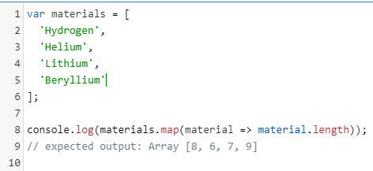

<a href="05.md">next</a>

<h2>Arrow functions</h2>

Во первых более лаконичный синтаксис.
Во вторых передача родительского this.

Синтаксис:

<ul>
<li>
<code>()</code> : список параметров, может отсутствовать если передается только 1 параметр
</li>
<li>
<code>=></code>
</li>
<li>
<code>{}</code> : тело функции, если в теле только return, то сами скобки можно опустить
</li>
</ul>

У стрелочных функций <strong>нет псевдо массива arguments</strong>, они всегда анонимные и всегда Function Expression.

К передаче родительского this вернемся после темы this

<a href="03.md">prev</a>
 
<a href="00.md">plan</a>
