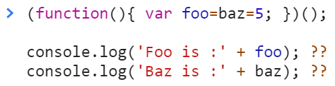
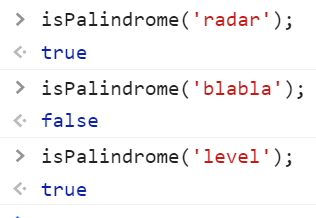
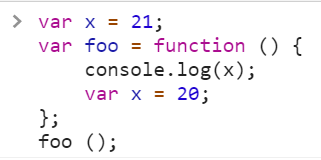
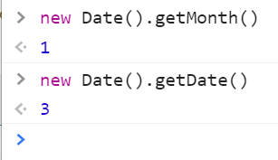
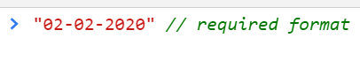
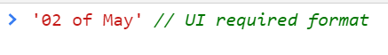

<a href="02.md">next</a>
<h2>Interview tasks</h2>

<h3>Task 1</h3>

<h3>Task 2</h3>

Напишите функцию проверки строки на 
<a href="https://ru.wikipedia.org/wiki/%D0%9F%D0%B0%D0%BB%D0%B8%D0%BD%D0%B4%D1%80%D0%BE%D0%BC#:~:text=%CE%B4%CF%81%C3%B3%CE%BC%CE%BF%CF%82%20%E2%80%94%20%C2%AB%D0%B1%D0%B5%D0%B3%2C%20%D0%B4%D0%B2%D0%B8%D0%B6%D0%B5%D0%BD%D0%B8%D0%B5%C2%BB,%D0%BD%D0%B0%20%D0%BB%D0%B0%D0%BF%D1%83%20%D0%90%D0%B7%D0%BE%D1%80%D0%B0%C2%BB%20%D0%B8%20%D0%BF%D1%80.">палиндром</a>
 

<h3>Task 3</h3>

<h3>Task 4</h3>

Задача из реальной практики.
 

 

 

<a href="00.md">plan</a>
