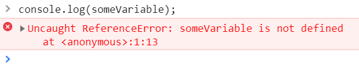
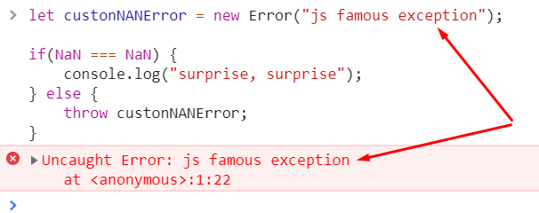
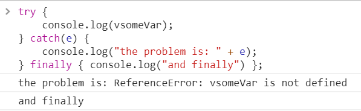

<a href="03.md">next</a>
<h2>Error</h2>

В js существует специальный объект <code>Error</code> для обработки ошибок.
Например попытка обращения к несуществующей переменной сгенирирует следующее:

Ошибка на примере относиться к типу ReferenceError (ссылки или обращения).
Предусмотрены и иные виды ошибок среди которых: SyntaxError, URIError, InternalError (js engine, к примеру: “too much recursion”).
На ряду со встроенными существует возможность создавать и кастомные ошибки при помощи специального объекта Error.

На примере создана кастомная ошибка, а затем вызвана по средствам оператора <code>throw</code>.

<h3>try, catch</h3>

Для обработки ошибок существует специальная конструкция <code>try - catch - finally</code>.
Блок <code>finally</code> не является обязательным.
В случае его наличия код в рамках этого блока выполнится <strong>в любом случае</strong>,
после обработки основных блоков (в том числе и если в одном из блоков кода была выполнена команда return,
в таком случае сперва будет выполнен код из блока finally).

Если код в блоке <code>try</code> выполняется без ошибок, блок <code>catch</code> игнорируется.
Если же ошибка генерируется, то мы попадем в блок <code>catch</code>, а в аргумент попадет сама ошибка.

<a href="01.md">prev</a>
 
<a href="00.md">plan</a>
