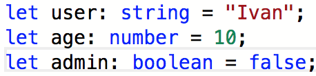
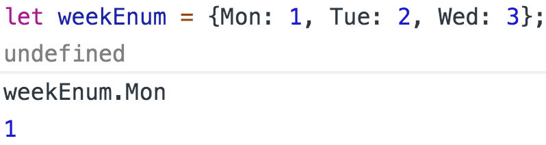
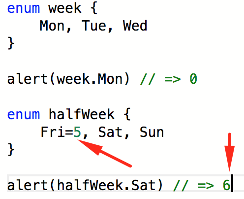
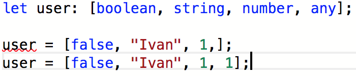

<h2>Typescript</h2>

(вик) - <a href="https://www.typescriptlang.org/index.html">язык</a> программирования, представленный Microsoft в 2012 году и
позиционируемый как средство разработки веб-приложений, расширяющее возможности JavaScript.

 
 

Разработчик - Андерс Хейлсберг.
 

Расширение файлов - <code>.ts</code>. Для браузера компилируется в обычный js.
Многие конструкции уже есть в современном стандарте ES6(class, arrow function, symbol),
но есть и по прежнему уникальные.

 

<h3>Переменные строго типа</h3>

TS строготипизированный язык, большинство типов данных хорошо знакомы.

 

 

Есть и уникальные:
<ul>
<li>
<code>enum</code> перечисление. Простыми словами последовательный набор именованных индексов.
Средствами обычного js enum можно реализовать так:

 

Через <code>enum</code> это выглядит проще, кроме того начальным индекс можно задать.

 

</li>
<li>
<code>any</code> значение переменной не известно и может быть любым
</li>
<li>
<code>void</code> чаще используется как идентификатор функции
которая ничего не возвращает, для не функций void можно присвоить только переменным
со значением <code>undefined</code> или <code>null</code>.
</li>
<li>
<code>tuple</code> массив с фиксированным количеством элементов.
 

</li>
</ul>

 
<a href="03.md">prev</a>
 
<a href="00.md">plan</a>
