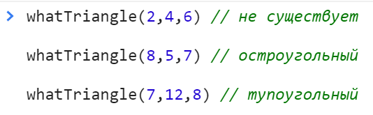

<a href="02.md">next</a>
<h2>Interview tasks</h2>

<ol>
<li>
Треугольники бывают: <strong>остроугольными</strong>, <strong>прямоугольными</strong> и <strong>тупоугольными</strong>
</li>
<li>
Треугольник не существует: если сумма длины двух любых его сторон меньше, либо равна длине третьей стороны
</li>
<li>
Прямогульный: сумма квадратов двух меньших сторон равны квадрату третьей стороны 
</li>
<li>
Тупоугольный: сумма квадратов двух меньших сторон меньше квадрата третьей стороны 
</li>
<li>
Остроугольный: сумма квадратов двух меньших сторон больше квадрата третьей стороны 
</li>
</ol>

<h3>Task 1</h3>

Напишите функцию которая проверяет треугольник на его тип. 
Функция принимает три числа, которые соответствуют длине каждой стороны.

<h3>Task 2</h3>

<a href="00.md">plan</a>
