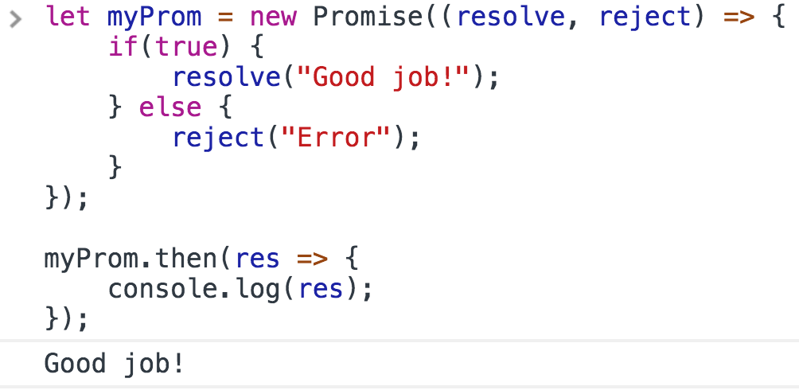
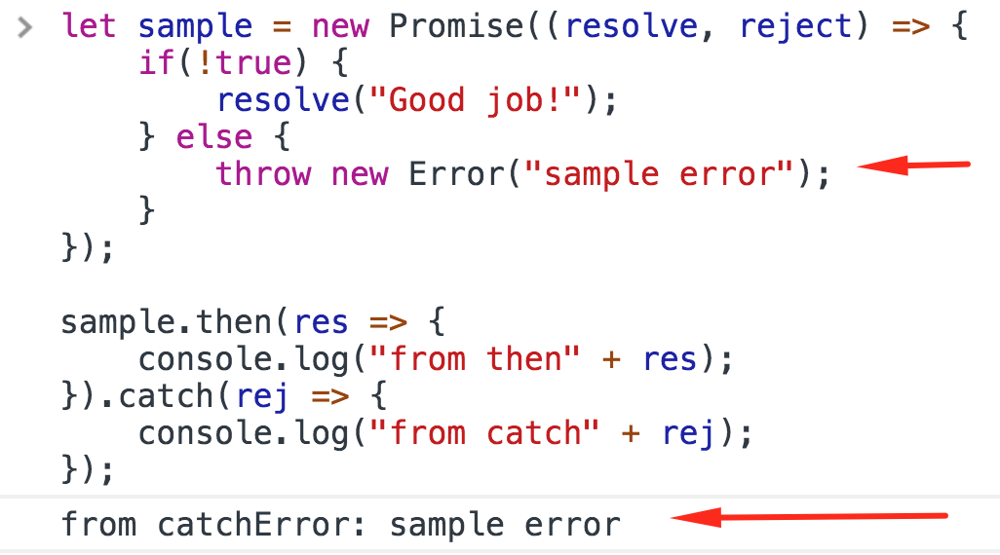

<a href="05.md">next</a>

<h2>Promises</h2>

<h3>Создание</h3>

Объект содержащий свое состояние.
Состояний этих 3.
<ol>
<li>
Pending(ожидание)
</li>
<li>
Resolved / Fulfilled(успешно выполнен)
</li>
<li>
Rejected(не выполнен)
</li>
</ol>

Коллбек внутри промиса называется executor, эта функция срабатывает сразу при объявлении и принимает 2 аргумента.
Первый - функция в которую попадет код если Промис будет исполнен успешно, второй - не успешно.

Состояние Промиса неизменно и назад не возвращается.
В объекте Промиса есть метод <code>then</code>, при помощи которого навешиваются сторонние обработчики. 
У then есть 2 аргумента. Первый обработчик успешного исполнения, второй ошибки (как правило не используют, заменяя его
конструкцией <code>catch</code> (равнозначно: <code>.then(null, onRejected)</code>)

Создание.
Конструктор <code>Promise</code> с функцией в качестве аргумента, которая
в свою очередь содержит 2 аргумента отвечающих за выполненное(resolve)
и не выполненное состояние(reject).

 

Условие в примере перевело Промис в состояние <code>resolved</code>, и сработал
обработчик переведя код в then. Теперь попадем в блок catch.

 

 

Обратите внимание, что в catch код попадет как из-за вызова 
  внутри Промиса функции reject() так и после генерации ошибки(в любом месте Промиса).

 

 

При последовательных вызовах (.then…then…then) в каждый следующий then переходит результат от предыдущего,
<strong>сохраняя последовательность</strong>. <a href="https://codepen.io/paawel/pen/yrNwVx?editors=0012">Пример</a>.
Описанное называют цепью вызовов. При возникновении ошибки, на любом из участков цепи, выполнение
кода перейдет в блок catch.

 
<a href="02.md">prev</a>
 
<a href="00.md">plan</a>
