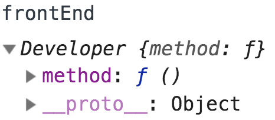
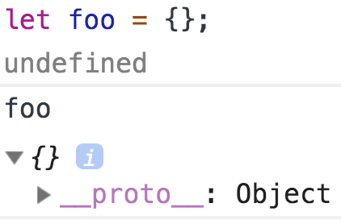
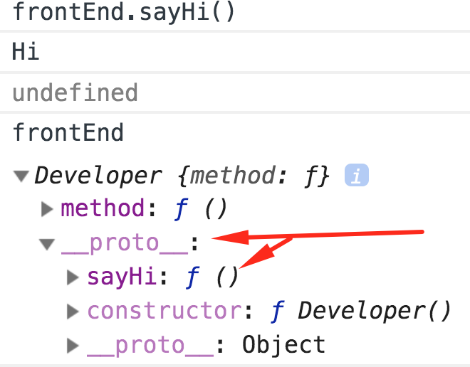

<a href="04.md">next</a>

<h2>__proto__</h2>

(вик) Прототип - отпечаток, оттиск, первообраз, оригинал.

В следующем <a href="https://codepen.io/paawel/pen/zXVomL?editors=1011">примере</a>
видим, что запись в <code>prototype</code> конструктора не записывает метод(свойство) в
сам конструктор, но только в его <strong>экземпляры</strong>.

Рассмотрим созданные <a href="https://codepen.io/paawel/pen/rbEWEZ?editors=1012">экземпляры класса Developer</a>.
Откроем их в обычной консоле(не кодпеновской). Как видим кроме ожидаемого метода из конструктора присутствует
еще одно свойство <code>__proto__</code>.

 

Более того, если создать самый обычный объект, без каких либо Конструкторов, мы так же обнаружим данное свойство.

 

Свойство <code>__proto__</code> это ссылка объекта на на его прототип, в котором будет искаться запрашеваемое свойство
(а также в прототипе прототипа и далее вверх, "цепочка прототипов"), если в исходном объекте оно обнаружено не будет.
Описанное выше и есть реализация наследования (прототипного наследования или наследования на прототипах) в js.
В первом примере в объекте <code>frontEnd</code> нет свойства <code>sayHi</code>, однако при вызове метод сработает.
Посмотрим где он находится.

 

 
<a href="02.md">prev</a>
 
<a href="../21/00.md">plan</a>
