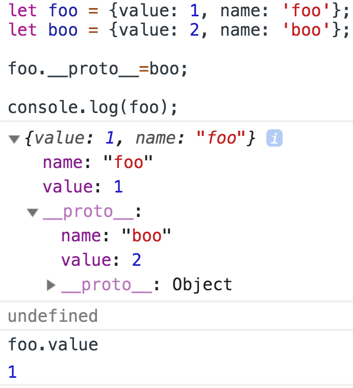
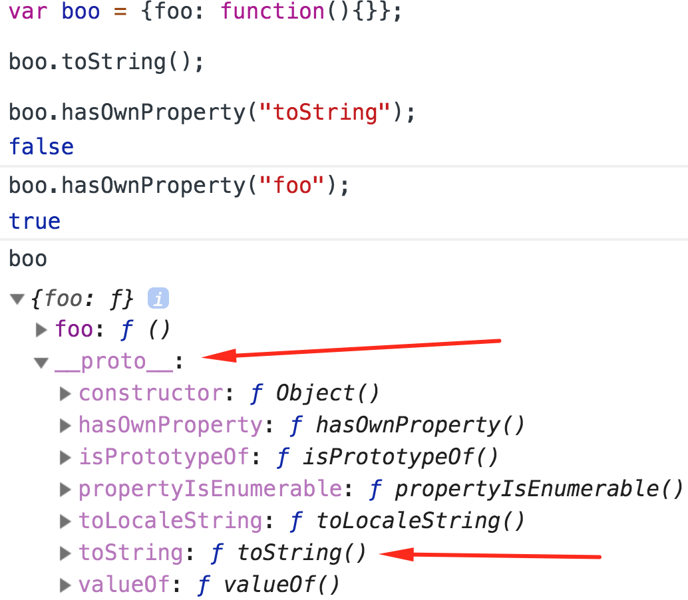
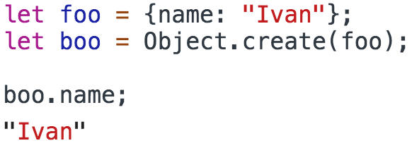
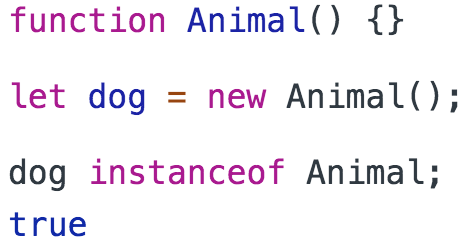
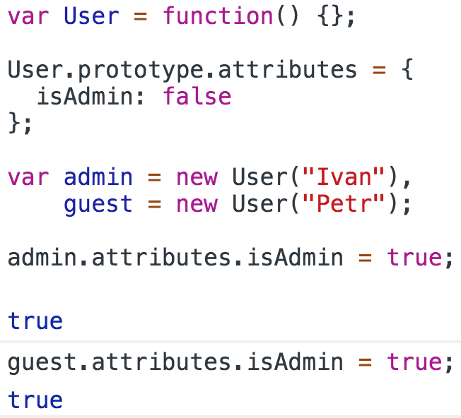
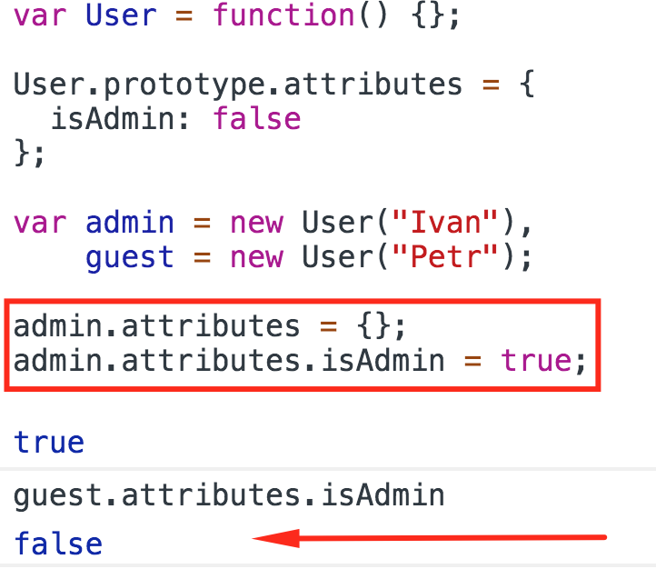
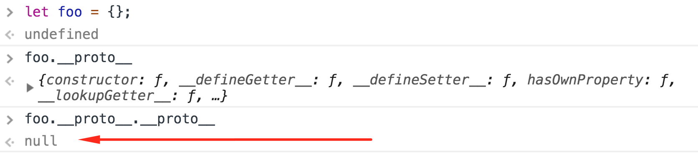

<h2>__proto__</h2>

Как уже было сказано выше, если запрашеваемое свойство(метод) объекта не
найдено, оно будет запрошено в прототипе объекта, если его не окажется
и там, то в прототипе прототипа и так далее, но что если свойство есть и
в самом объекте и в его прототипе?

 
Посмотрим пример

 

В спецификацию ECMAScript <code>__proto__</code> обозначено как <code>[[Prototype]]</code>.

<h3>hasOwnProperty</h3>

Специальный метод, который позволяет установить является ли свойство нативным
(есть в самом объекте) либо оно было унаследовано из прототипа.
На примере создадим объект, вызовем метод и проверим является ли он нативным.

 

<h3>Object.create</h3>

Метод конструктора Object, который в качестве аргумента принимает прототип
создаваемого объекта.

 

<h3>instanceof</h3>

Возвращает Класс (Конструктор объекта).

 

<h3>Задача на закрепление</h3>

Разберем почему

<h4>Вариант первый</h4>
 

 
 

<h4>Вариант второй</h4>
 

<h3>Самый глубокий уровень __proto__</h3>

 

 
<a href="03.md">prev</a>
 
<a href="00.md">plan</a>
