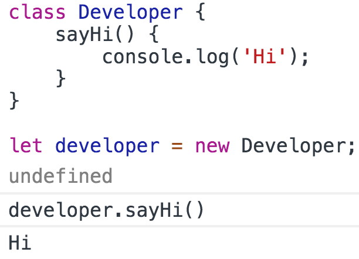
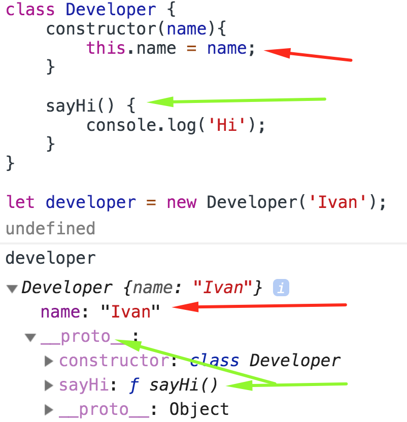
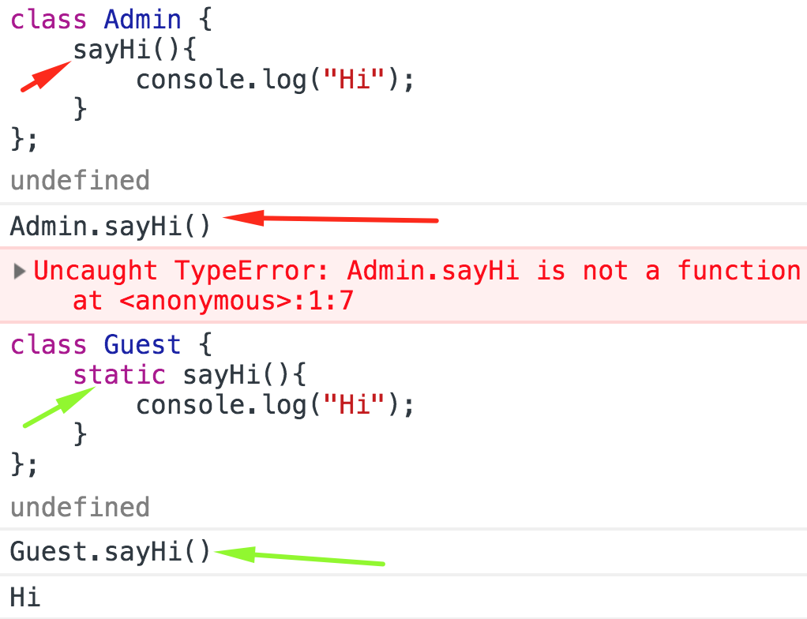

<a href="03.md">next</a>

<h2>Class</h2>

Конструкция появилась в ES6.

 
 

Кроме кастомных методов у Класса есть метод
<code>constructor</code>. Он запустится при создании
экземпляра и запишет описанные там поля во вновь созданный объект.

 
 

Запись в <code>constructor</code> равносильна записи в Конструкторе-функции(поля this),
А запись кастомных методов равносильна записи в <code>prototype</code> Функции-конструктора.

<h3>Static methods</h3>

Статическими называют методы(свойства) доступ к которым не требует создания экземпляра данного класса.

 
 

 
<a href="01.md">prev</a>
 
<a href="00.md">plan</a>
