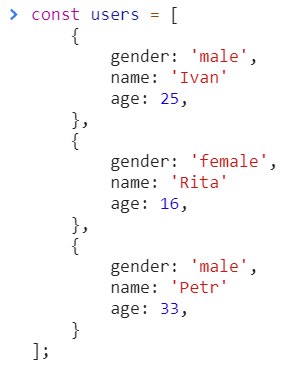

<a href="02.md">next</a>
<h2>Interview tasks</h2>

<h3>Task 1</h3>

Напишите функцию удаления элемента массива по индексу.
Первый аргумент - массив, а все другие аргументы — индексы элементов, которые удаляем из массива. 
Функция должна возвращать новый массив.

 

Разберем вариант <a href="https://codepen.io/paawel/pen/Rwogzyw?editors=0012">решения</a>.

<h3>Task 2</h3>

Output?

 

<h3>Task 3</h3>

Как установить последовательную цепь во втором таске ?

<h3>Task 4</h3>

Найдите средний возраст пользователей.
***среднее - число равное сумме всех чисел деленное на их количество***

 

<a href="00.md">plan</a>
