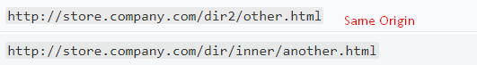
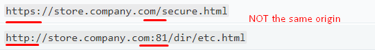

<a href="04.md">next</a>

<h2>Same Origin Policy</h2>

Same Origin - совпадение 3-х параметров в урле: протокола, доменного имени и порта.
Любое не совпадение означает что ресурсы считаються разными.

 

 

В целях безопасности сайты с разными Origin не могут иметь доступ друг к другу(принцип Same Origin Policy).
Предположим в одном браузере открыт банковский ресурс(пароли, финансовая информация и пр), а во второй
вкладке социальная сеть или потенциально вредоносный ресурс. Ограничения Same Origin Policy осуществляет
браузер.

Существуют механизмы обхода Same Origin Policy, такие как CORS (набор заголовков, которые позволяют серверу и браузеру определять,
какие запросы для междоменных ресурсов(изображения, таблицы стилей, скрипты) разрешены) или JSONP.

<a href="02.md">prev</a>
 
<a href="00.md">plan</a>
