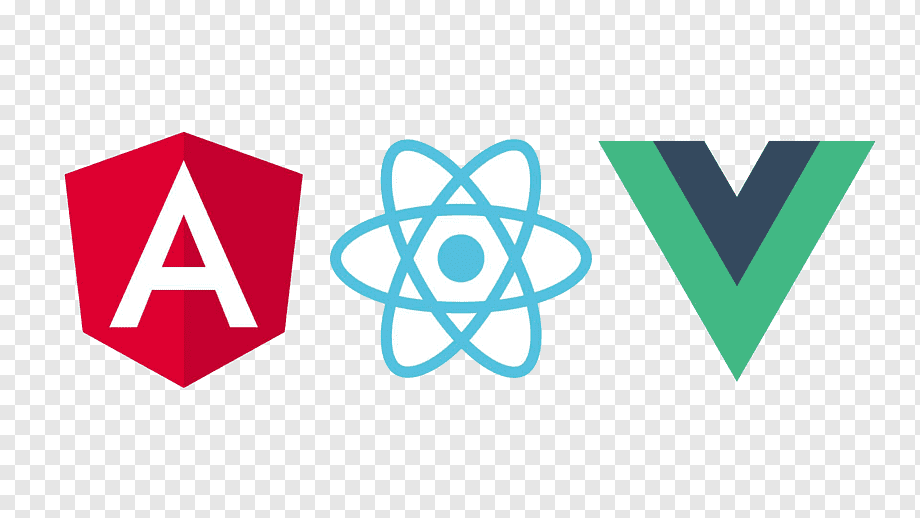
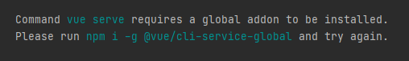

<h2>Vue JS</h2>

<a href="https://cli.vuejs.org/">Vue CLI install</a>
 
проверка установки - <code>vue --version</code>

По ходу запуска появится сообщение
 

 
Просто запустите команду из сообщения <code>npm i -g @vue/cli-service-global</code>
 

Затем может понадобится
 
<code>npm install @vue/babel-preset-app --save-dev</code>

<a href="03.md">prev</a>
 
<a href="00.md">plan</a>
