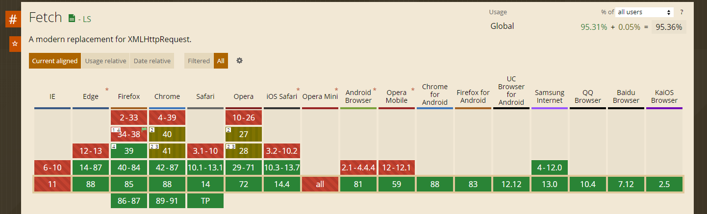
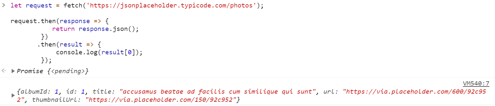
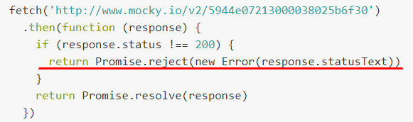

<a href="05.md">next</a>

<h2>Ajax fetch</h2>

<h3>Fetch API</h3>

API призван заменить старый синтаксис XMLHttpRequest.
Поддержка не полная, но широкая. 

 

Fetch принимает 1 обязательный аргумент - url запроса (и не обязательный второй аргумент:  метод, заголовки и пр), 
возвращает Promise с результатом вызова.

Если передан только 1 аргумент, то используется метод GET.

 

Пример запроса методом fetch

 

<h4>Обработка ошибок.</h4> 

В блок catch (fetch API), попадают только network ошибки. 
То есть связанные с сетью. Например, когда запрос отваливается по таймауту. 
Ошибки другого рода можно сгенирировать вручную внутри then блока.

Например:

 
<a href="03.md">prev</a>
 
<a href="00.md">plan</a>
