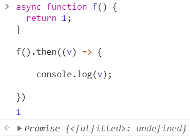
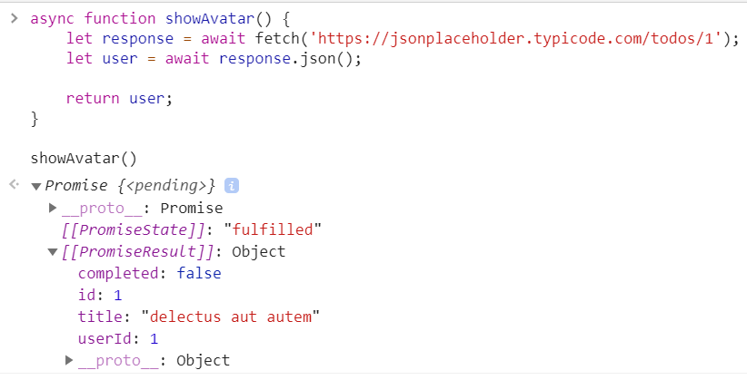

<a href="05.md">next</a>

<h2>Async/await</h2>

Cпециальный синтаксис для работы с промисами.

<ul>
<li>
Ключевое слово <code>async</code> ставится перед функцией.
 

</li>
<li>
Всегда возвращает промис (Значения других типов оборачиваются в завершившийся успешно промис)
</li>
<li>
Ключевое слово <code>await</code> может располагаться только внутри async функции
(Если использовать await внутри функции без async - синтаксическая ошибка)
</li>
<li>
<code>await</code> заставит интерпретатор JavaScript ждать до тех пор, пока промис справа от await не выполнится.
По сути - «синтаксический сахар» для получения результата промиса(promise.then).

</li>
</ul>

<a href="03.md">prev</a>
 
<a href="00.md">plan</a>
