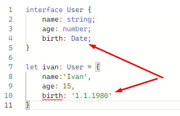
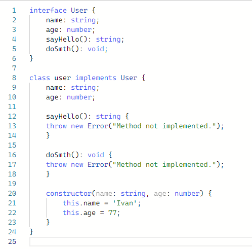
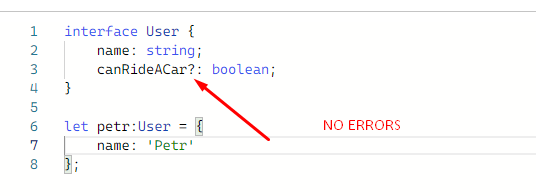
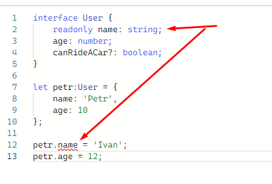

<a href="03.md">next</a>

<h2>Interface</h2>

Определяет свойства и методы, которые объект(класс, аргумент и пр) должен реализовать.
Помогает избежать ошибок, связанных с неявными присваиваниями и преобразованиями.
Если в передаваемый объект добавить свойство, которого нет в интерфейсе или, наоборот, убрать одно из описанных, компилятор TS выдаст ошибку о несоответствии типов.

Кроме свойств, интерфейсы могут описывать и методы.

<h3>Необязательные(опциональные) свойства</h3>

Некоторые свойства существуют только в определенных условиях, либо отсутствуют вообще. Задаются они при помощи знака вопроса <code>?</code>.

<h3>Cвойства только для чтения (readonly)</h3>

Cвойства которые можно задать <strong>только в момент создания объекта.</strong> При попытке переопределить далее - ошибка.

 
<a href="01.md">prev</a>
 
<a href="00.md">plan</a>
