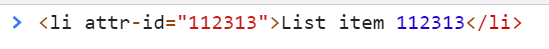
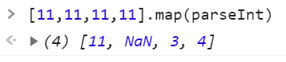

<a href="02.md">next</a>
<h2>Interview tasks</h2>

<h3>Task 1</h3>

Не вынемая элемента из потока сделайте так, чтобы внутренний квадрат отбивался от верхней границы родителя на 100px

<h3>Task 2</h3>

<ul>
<li>
<code>!(1-1)</code>
</li>
<li>
<code>!!(2-1)</code>
</li>
<li>
<code>"Green" && "Red" && 'Blue'</code>
</li>
<li>
<code>"Black" || "White"</code>
</li>
<li>
<code>typeof null</code>
</li>
<li>
<code>NaN === NaN</code>
</li>
</ul>

<h3>Task 3</h3>

Приходит большой список содержащий элементы типа:
 
Нужно написать код, чтобы при клике на элемент выводило значение которое написано в attr-id

<h3>Task 4</h3>

Объясните(порассуждайте) почему:
 

<a href="00.md">plan</a>
