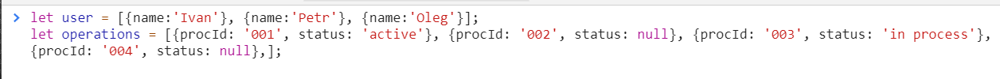
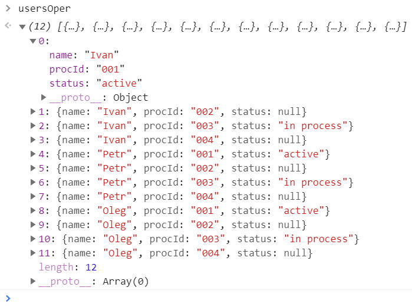

<a href="02.md">next</a>
<h2>Interview tasks</h2>

<h3>Task 1</h3>

Реализуйте прижатый к подвалу футер.

<h3>Task 2</h3>

Реализуйте счетчик с преустановленным значением и возможностью обнуления значения,
объясните что такое замыкание.

<h3>Task 3</h3>

Есть 2 массива на входе.
 
<code>
let user = [{name:'Ivan'}, {name:'Petr'}, {name:'Oleg'}];
let operations = [{procId: '001', status: 'active'}, {procId: '002', status: null}, {procId: '003', status: 'in process'}, {procId: '004', status: null},];

</code>

 

 

На выходе: для каждого юзера все 4 статуса.
 

<a href="00.md">plan</a>
